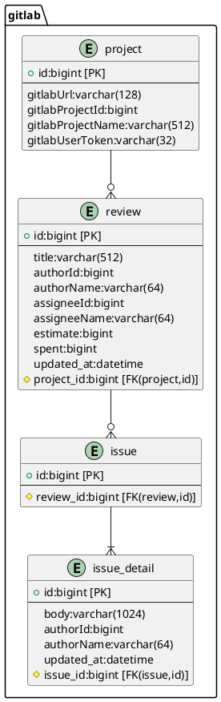

# DB 設計

```plantuml
@startuml
package gitlab {
    entity project {
        +id:bigint [PK]
        --
        gitlabUrl:varchar(128)
        gitlabProjectId:bigint
        gitlabProjectName:varchar(512)
        gitlabUserToken:varchar(32)
    }

    entity review {
        +id:bigint [PK]
        --
        title:varchar(512)
        authorId:bigint
        authorName:varchar(64)
        assigneeId:bigint
        assigneeName:varchar(64)
        estimate:bigint
        spent:bigint
        updated_at:datetime
        #project_id:bigint [FK(project,id)]
    }

    entity issue {
        +id:bigint [PK]
        --
        #review_id:bigint [FK(review,id)]
    }

    entity issue_detail {
        +id:bigint [PK]
        ---
        body:varchar(1024)
        authorId:bigint
        authorName:varchar(64)
        updated_at:datetime
        #issue_id:bigint [FK(issue,id)]
    }
}

project --o{ review
review --o{ issue
issue --|{ issue_detail
@enduml
```
